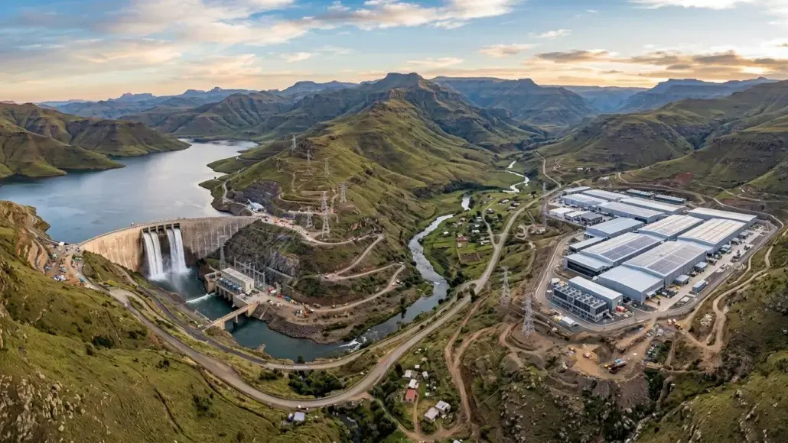

# Existing Hydropower Can Firm 24/7 AI Datacenter Demand

<p align="center">
  
</p>

This repository contains the code and the figure-ready data to reproduce the
figures and headline results of the study, which evaluates how the **existing**
global hydropower fleet can supply firm, around-the-clock power to AI datacenters
across 81 grid regions in 49 countries. The pipeline couples a machine-learning-
corrected hydrological model (SWAT+ with an LSTM-Transformer streamflow
correction) to an improved reservoir-operation and dispatch model (REVUB) with
cascade coordination, pumped storage, datacenter re-dispatch, an effective
load-carrying-capability (ELCC) reliability criterion, and cross-region
interconnection, and then quantifies the river-impact and carbon consequences.

Reference climate combination: **GFDL-ESM4 / SSP3-7.0**, existing hydropower only
("nofuture"), with the **15-member GCM × SSP ensemble** used where a figure is
inherently multi-model (Fig. 2, Fig. 3b/3c).

> Cloning this repository and running one script regenerates the figure panels
> directly from the bundled data - no upstream model run is required.

---

## 1. System Requirements

| | |
|---|---|
| **OS** | Linux / macOS / Windows (tested on Ubuntu 22.04) |
| **Python** | 3.11 |
| **Key packages** | numpy, pandas, scipy, matplotlib, geopandas, shapely, pyogrio, adjustText, colorcet |
| **Hardware** | Figure reproduction: any modern laptop (~2 GB RAM, a few minutes). Full pipeline: a high-performance-computing cluster (see Runtime below) |
| **Disk** | ~150 MB for this repository (bundled figure data included) |

The figure-reproduction path needs only the packages in `requirements.txt`.
The full upstream pipeline (stages 01-05) additionally needs `torch` and
`optuna` (streamflow ML), optionally `gurobipy` (ELCC MILP; commercial license),
and a working QSWAT+ / SWAT+ installation.

**Runtime.** Reproducing the figures from the bundled data takes only a **few
minutes** on a laptop. Re-running the **entire pipeline** end-to-end - building
and running the SWAT+ models, training and applying the LSTM-Transformer
streamflow correction, and running the REVUB dispatch plus impact metrics across
all 81 grid regions and 15 climate combinations - is a large HPC workload on the
order of **1-2 months** of wall-clock compute, not a laptop task.

## 2. Installation Guide

```bash
git clone <this-repository-url>
cd <repository>

# Recommended: a clean Python 3.11 environment
conda create -n hydro-dc python=3.11 -y
conda activate hydro-dc
pip install -r requirements.txt
```
Typical installation time: under 5 minutes.

## 3. Demo

The figure panels are not committed to the repository; a single script builds
them from the bundled data into `figures/`:

```bash
bash 06_figures/reproduce_figures.sh           # uses `python` on PATH
# or:  PYTHON=/path/to/python bash 06_figures/reproduce_figures.sh
```
This regenerates the **29 paper-panel PNGs** (the 25 data panels of Fig. 1-6;
Fig. 3a is shown as 5 per-continent facets) into `figures/` in about 2-4 minutes
on a laptop; intermediate/alternate panels are pruned automatically. Expected
output: `== DONE: ... paper-panel PNGs ... (failures: 0) ==`. Fig. 5a and 5c
additionally need HydroBASINS, and Fig. 4e/4f need the IUCN Red List; those four
panels are external-data-dependent and are not produced by the default run (see below).

## 4. Instructions for Use

The repository is organized by pipeline stage. Stages 01-05 document and
reproduce the full modeling chain; stage 06 reproduces the figures from the
bundled data.

| Stage | Folder | What it does |
|---|---|---|
| 01 | `01_swat_setup_run/` | Build and batch-run the 81-region SWAT+ models |
| 02 | `02_ml_streamflow/` | LSTM-Transformer probabilistic streamflow correction + future inference (`09_lstm_transformer_prob.py` is the production model) |
| 03 | `03_datacenter_demand/` | Regional electricity-load profiles; the 24/7 datacenter load with cooling/PUE shaping is constructed inside the dispatch stage |
| 04 | `04_revub_dispatch/` | Improved REVUB: cascade coordination, pumped storage, datacenter re-dispatch, ELCC (one-day-in-ten-years), cross-region interconnection |
| 05 | `05_impact_metrics/` | River-impact and carbon metrics: sediment (F1), ecology (F2), water supply (F3), carbon / G-res reservoir GHG (F4) |
| 06 | `06_figures/` | All figure scripts + `reproduce_figures.sh` + public-domain basemaps (`gis/`) |

Stages 01-05 operate on the large raw model inputs and per-region outputs, which
are **not** bundled here (see Data Sources). They are provided for transparency
and to allow a full re-run given the inputs. To reproduce only the figures, use
stage 06 as in the Demo.

**Panels that need external datasets** (the other 23 panels reproduce from the bundle):
- **Fig. 4e, 4f** (threatened freshwater-fish overlay) use the **IUCN Red List**
  (licensed) and are **omitted** from this repository. Their build scripts
  (`fig5_*.py`) are included; with an IUCN download under
  `06_figures/data_external/iucn/` they can be regenerated.
- **Fig. 5a, 5c** (basin-fill maps of the irrigation gap and sediment index) need
  **HydroBASINS** polygons (free, hydrosheds.org). They are **not included**;
  build with `fig4_maps_basin.py` after placing HydroBASINS under
  `06_figures/data_external/`.

## Directory Structure

```
.
├── README.md
├── requirements.txt
├── LICENSE
├── 01_swat_setup_run/      # SWAT+ build + batch run
├── 02_ml_streamflow/       # LSTM-Transformer streamflow correction
├── 03_datacenter_demand/   # regional load profiles
├── 04_revub_dispatch/      # improved REVUB dispatch (A-E)
├── 05_impact_metrics/      # sediment / ecology / supply / carbon (F1-F4)
├── 06_figures/             # figure scripts + reproduce_figures.sh
│   ├── fig*.py             # one script per panel
│   ├── revub_*.py          # shared styling / naming / geo helpers
│   ├── fig_radar/          # Fig. 6a firm-power radar (self-contained)
│   ├── reproduce_figures.sh
│   └── gis/                # Natural Earth + GADM basemaps (public domain)
├── data/                   # bundled figure-input data (see below)
└── figures/                # created by reproduce_figures.sh (not committed)
```

## Data Sources

**Bundled in this repository** (`data/`, ~108 MB): the figure-ready tables and
river-network GeoPackages for the GFDL-ESM4/SSP3-7.0 "nofuture" headline run and
the 15-combo ensemble - coverage (`cov_*`, `monthly_cov_*`), supply/ELCC
(`dc_supply_*`, `hydro_*`), pumped storage (`ps_*`), cross-region flows
(`fig3a_*`), river impacts (`fig4_*`, `map_*`, `reach_*.gpkg`), carbon/equity
(`equity_master.csv`, `climate_equity.csv`), and the per-figure inputs (`fig*.csv`).
Basemaps (`06_figures/gis/`): **Natural Earth** (public domain) and **GADM**
(free for academic use).

**The complete reproduction dataset** - the built SWAT+ models (excluding
weather), the trained LSTM-Transformer models, the 15-combo corrected streamflow
that feeds the dispatch, the 4,193-station net-head database, and the
station-screening figures - is distributed separately as a large archive
(≈ 150 GB). [Archive link / DOI: to be added.]

**Not redistributed** (used upstream, obtain from the original providers):
- **S&P Global "451 Research Datacenter KnowledgeBase"** - commercial datacenter
  inventory (licensed); only aggregated results derived from it appear here.
- **IUCN Red List of Threatened Species** - species ranges for the Fig. 4e/4f
  threatened-fish overlay (free academic registration); those two panels are
  omitted from this repository.
- **HydroBASINS / BasinATLAS** (hydrosheds.org) - sub-basin polygons for the
  Fig. 5a/5c basin-fill maps.
- Weather forcing (ISIMIP3b / ERA5-Land) and base GIS layers (FABDEM, HWSD,
  SoilGrids, GRFR) are fetched by the stage-01/02 download scripts.

## License

Code is released under the **MIT License** (see `LICENSE`). The bundled data
(`data/`) and rendered figures (`figures/`) are released under **CC BY 4.0**.
Third-party datasets retain their own licenses (see Data Sources).

## Contact

Questions and issues: please open a GitHub issue, or contact
**chengfeng@cornell.edu** (PEESE Group, Cornell University).
